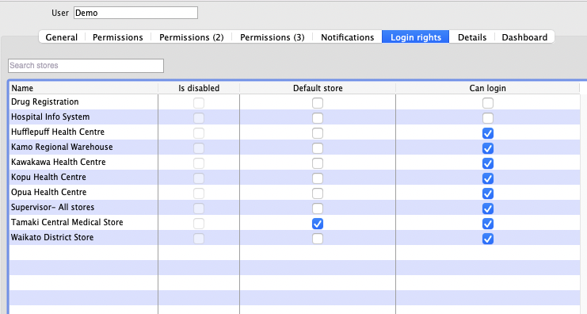
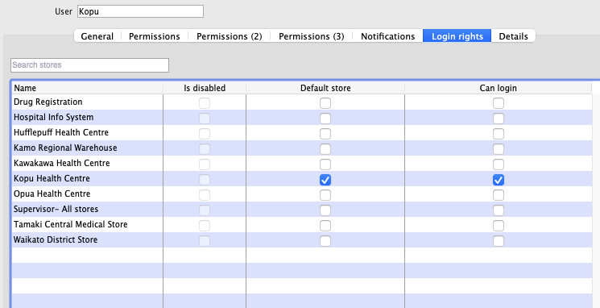

# Description of omsupply_withdata image

## openmsupply-client branch
https://github.com/openmsupply/openmsupply-client/releases/tag/V1-beta-buildtest
## remote-server branch
https://github.com/openmsupply/remote-server/releases/tag/V1-beta-buildtest2
## data file
Used reference data file from jottacloud `Jottacloud::mSupply/ReferenceDataFile/Current (2020-07-09) master`, with some modifications
* one site `demo` with password `pass` with all stores
* all user passwords changed to `pass`
* changed users name as per below

data file saved to [demo_primary](https://drive.google.com/drive/u/1/folders/1nknLb6HyiZ5sSweB79LHlSHy8OMb2S8n)

## users
`Demo` password: `pass`

`Demo2` password: `pass`

`Kopu` password: `pass`

`Waikato` password: `pass`

### Dockerised with

[dockerise.sh](dockerise.sh)

## dockerhub tags

https://hub.docker.com/layers/omsupply_withdata/msupplyfoundation/omsupply_withdata/be-V1-beta-buildtest2_fe-V1-beta-buildtest/images/sha256-c136cbbe8520477a59563f082d3d5c8d617a3acb9f8ece0185da5b03e0baa525?context=repo

